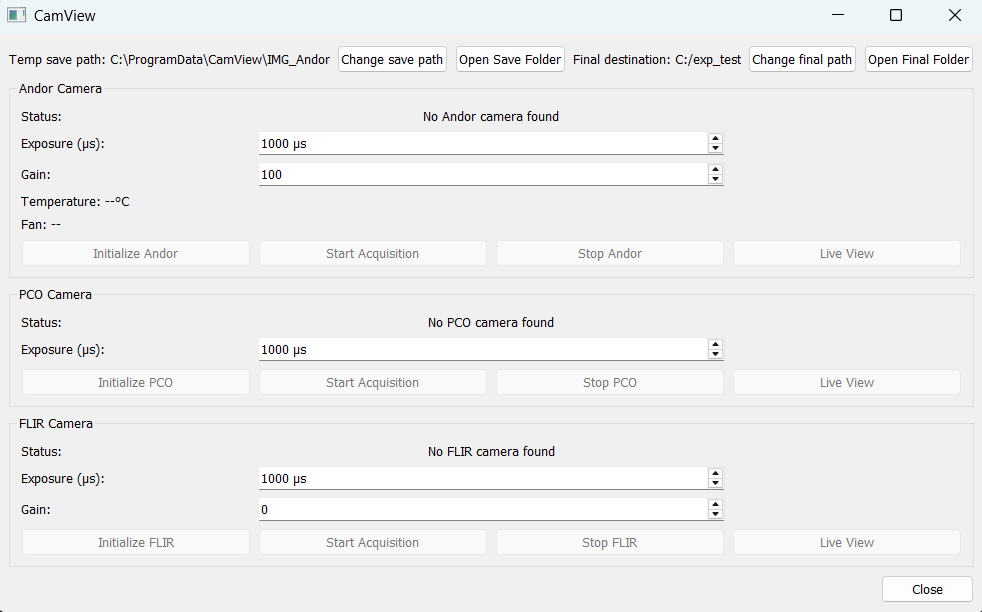

# CamView

A camera-control and live-view application for scientific imaging systems, developed for experimental physics applications.

CamView provides a graphical interface for controlling and monitoring multiple scientific cameras used in experimental setups. The application was originally developed in Python and later migrated to a C++/Qt implementation.

---

## Features

- Live camera preview
- Support for multiple scientific camera systems
- Camera initialization and configuration
- Camera selection and management
- Automated image acquisition
- Network-based communication between components
- Configurable acquisition settings
- Integration with camera vendor SDKs
- Graphical user interface for experimental use
- Modular camera support

---

## Supported Cameras

The project was developed with several scientific camera systems:

- **PCO Pixelfly**
- **Andor iXon EMCCD**
- **FLIR Grasshopper**

Camera communication is implemented through the respective manufacturer SDKs and interfaces.

---

## Architecture

```text
                    ┌─────────────────────┐
                    │       CamView       │
                    │     C++ / Qt 5      │
                    └──────────┬──────────┘
                               │
              ┌────────────────┼────────────────┐
              │                │                │
              ▼                ▼                ▼
        ┌───────────┐    ┌───────────┐    ┌───────────┐
        │    PCO    │    │   Andor   │    │   FLIR    │
        │  Pixelfly │    │   iXon    │    │Grasshopper│
        └───────────┘    └───────────┘    └───────────┘
              │                │                │
              └────────────────┼────────────────┘
                               │
                               ▼
                    Image Acquisition
                     & Live Visualization
```

---

## Technology Stack

### C++ Application

- **C++**
- **Qt 5**
- **Qt Widgets**
- **Qt Network**
- **CMake**
- **vcpkg**
- **Visual Studio**
- **Windows**

### Camera Interfaces

- **PCO SDK**
- **Andor Camera SDK**
- **FLIR Spinnaker SDK**
- **TCP/IP**

### Development & Prototyping

The original implementation and parts of the development workflow used:

- Python
- QtPy
- PySpin
- TCP sockets
- Scientific Python tools

---

## Communication

CamView uses TCP-based communication between the graphical application and camera-control components.

The application includes a TCP server using:

```text
Port: 33133
```

The communication layer allows camera commands, acquisition settings, and status information to be exchanged between the relevant components.

---

## Project Structure

```text
CamView/
├── src/
│   ├── gui/
│   ├── camera/
│   ├── network/
│   └── acquisition/
├── include/
├── resources/
├── config/
├── CMakeLists.txt
├── README.md
└── ...
```

> The exact structure may differ depending on the current version of the project.

---

## Installation

### Requirements

- Windows
- Visual Studio
- CMake
- Qt 5
- vcpkg
- Required camera SDKs

### Build

Clone the repository:

```bash
git clone https://github.com/YOUR_USERNAME/CamView.git
cd CamView
```

Configure the project using CMake:

```bash
cmake -S . -B build
```

Build the application:

```bash
cmake --build build --config Release
```

Depending on the camera hardware being used, the corresponding manufacturer SDK must also be installed and configured.

---

## Usage

After starting CamView, the user can:

1. Initialize the connected camera systems.
2. Select the desired camera.
3. Configure acquisition parameters.
4. Start a live preview or image acquisition.
5. Monitor acquired images through the GUI.
6. Save or process the acquired data as required by the experimental setup.

---

## Background

CamView was developed in the context of experimental physics research involving optical systems, laser control, and scientific imaging.

The software was designed to simplify the operation of scientific cameras used for measurements and experimental monitoring. Particular emphasis was placed on reliable camera initialization, live visualization, automated acquisition, and integration with existing laboratory infrastructure.

The project also served as a transition from an earlier Python-based implementation toward a C++/Qt desktop application.

---

## My Contributions

- Designed and implemented parts of the camera-control software
- Developed the graphical user interface using Qt
- Implemented TCP-based communication
- Integrated scientific camera SDKs
- Implemented camera initialization and acquisition workflows
- Developed live-view functionality for different camera systems
- Worked on the migration from Python/QtPy to C++/Qt
- Integrated the application into an existing experimental laboratory environment
- Debugged and tested hardware/software interfaces

---

## Screenshots

### Main Interface

Add a screenshot of the main CamView interface here.



---

## Development Context

This project was developed in the context of experimental physics research involving optical systems, laser control, and scientific imaging.

The software interacts directly with laboratory hardware and therefore combines software engineering with hardware integration and experimental requirements.

---

## License

This project is provided for educational and research purposes.

Add your license information here.

---

## Author

**Florian Hees**

B.Sc. Applied Physics with Computer Science  
Johannes Gutenberg University Mainz

[GitHub](https://github.com/YOUR_USERNAME)
